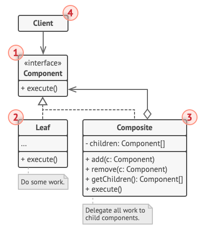
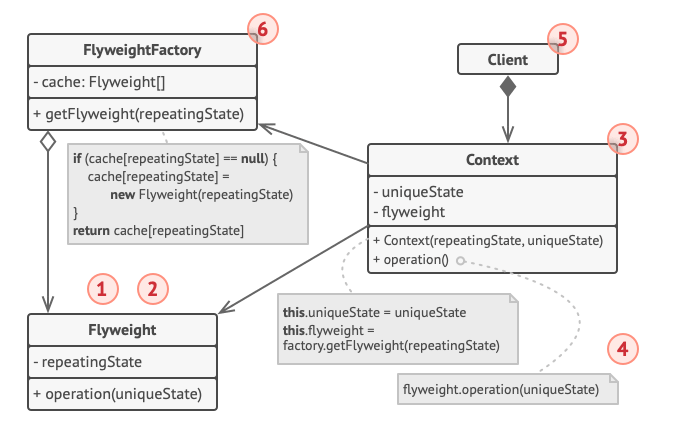

### Laboratorul 2. TMPS

## Tema: Șabloanele de proiectare structurale

**Să se implementeze la nivel de cod 5 șabloane de proiectare structurale din cele 7.**

### Atenție:
* Elaborați cîte o aplicație pentru fiecare șablon de proiectare ales în parte. Să fiți capabili să
identificați participanții șabloanelor implementate pe baza claselor/interefețelor. Aplicațiile
elaboratre trebuie să posede un sens, să nu fie doar structura șablonului de proiectare. 
* Puteți combina șabloanele de proiectare între ele. În așa caz într-o aplicație veți avea 2 sau mai
multe șabloane implementate.
* Limbajul de programare în care veți efectua laboratorul trebuie să fie orientat pe obiecte.

### Întrebări la apărarea laboratorului:
* Adapter - scopul, problema care o rezolvă, structura(diagrama de clase), aplicabilitatea, modul
de implementare, argumente pro şi contra, relațiile cu alte șabloane de proiectare

* Bridge - scopul, problema care o rezolvă, structura(diagrama de clase), aplicabilitatea, modul
de implementare, argumente pro şi contra, relațiile cu alte șabloane de proiectare

* Composite - scopul, problema care o rezolvă, structura(diagrama de clase), aplicabilitatea,
modul de implementare, argumente pro şi contra, relațiile cu alte șabloane de proiectare
  - **Composite** este un model de proiectare structurală care vă permite să compuneți obiecte în structuri arborescente
  și apoi să lucrați cu aceste structuri ca și cum ar fi obiecte individuale.
  - Utilizarea modelului Composite are sens numai atunci când modelul de bază al aplicației dvs. poate fi reprezentat ca
  un arbore.
  De exemplu, imaginați-vă că aveți două tipuri de obiecte: Produse și Cutii. O Cutie poate conține mai multe Produse,
  precum și un număr de Cutii mai mici. Aceste cutii mici pot conține, de asemenea, unele produse sau chiar cutii mai
  mici, și așa mai departe.
  - Diagrama de clase:
  ---
  
  - Argumente:
    * Pro:
      1. Puteți lucra cu structuri de arbore complexe mai convenabil: utilizați polimorfismul și recursiunea în avantajul
      dvs.
      2. Principiul Open/Closed. Puteți introduce noi tipuri de elemente în aplicație fără a rupe codul existent,
      care acum funcționează cu arborele de obiecte.
    * Contra:
      1. Ar putea fi dificil să oferiți o interfață comună pentru clasele a căror funcționalitate diferă prea mult. În
      anumite scenarii, ar trebui să generalizați în exces interfața componentelor, făcând-o mai greu de înțeles.

* Decorator - scopul, problema care o rezolvă, structura(diagrama de clase), aplicabilitatea,
modul de implementare, argumente pro şi contra, relațiile cu alte șabloane de proiectare

* Facade - scopul, problema care o rezolvă, structura(diagrama de clase), aplicabilitatea, modul
de implementare, argumente pro şi contra, relațiile cu alte șabloane de proiectare

* Flyweight - scopul, problema care o rezolvă, structura(diagrama de clase), aplicabilitatea,
modul de implementare, argumente pro şi contra, relațiile cu alte șabloane de proiectare
  - **Flyweight** este un model de design structural care vă permite să încadrați mai multe obiecte în cantitatea
  disponibilă de RAM, partajând părți comune de stare între mai multe obiecte, în loc să păstrați toate datele în
  fiecare obiect.
  - Pentru a vă distra puțin după ore lungi de lucru, ați decis să creați un joc video simplu: jucătorii se mișcau pe o
  hartă și se împușcau între ei. Ați ales să implementați un sistem de particule realist și să faceți din acesta o
  caracteristică distinctivă a jocului. Cantități uriașe de gloanțe, rachete și schije de la explozii ar trebui să
  zboare pe toată harta și să ofere jucătorului o experiență palpitantă.
  Problema reală a fost legată de sistemul dvs. de particule. Fiecare particulă, cum ar fi un glonț, o rachetă sau o
  bucată de șrapnel, era reprezentată de un obiect separat, care conținea o mulțime de date. La un moment dat, când
  măcelul de pe ecranul unui jucător a atins punctul culminant, particulele nou create nu se mai potrivesc în memoria
  RAM rămasă, așa că programul s-a prăbușit.
  - Diagrama de clase:
  ---
  
  - Argumente:
    * Pro:
      1. Puteți salva o mulțime de memorie RAM, presupunând că programul dvs. are o mulțime de obiecte similare.
    * Contra:
      1. S-ar putea să tranzacționați RAM pe cicluri CPU când unele dintre datele de context trebuie recalculate de
      fiecare dată când cineva apelează la o metodă Flyweight.
      2. Codul devine mult mai complicat. Noii membri ai echipei se vor întreba mereu de ce starea unei entități a fost
      separată în acest fel.

* Proxy - scopul, problema care o rezolvă, structura(diagrama de clase), aplicabilitatea, modul de
implementare, argumente pro şi contra, relațiile cu alte șabloane de proiectare

* Diferența dintre șabloane de proiectare și principii de proiectare
  - **Principiile de proiectare** sunt principii abstracte de bază pe care ar trebui să le respectăm atunci când
  proiectăm software. Amintiți-vă că nu sunt concrete, ci mai degrabă abstracte. Ele pot fi aplicate în orice limbă, 
  pe orice platformă indiferent de stat atâta timp cât suntem în condițiile admise.
  - **Sabloanele de proiectare** sunt soluții la problemele din lumea reală care apar din când în când, așa că, în loc
  să reinventăm roata, urmăm modelele de design bine dovedite, testate de alții și sigur de urmat. Acum, modelele de
  design sunt specifice; există termeni și condiții doar în care un model de design poate fi aplicat.

* Diferența dintre Inversion of Control și Dependency injection
  - **Modelul Inversion-of-Control (IoC)** este despre furnizarea oricărui tip de apel invers (care „implementează” și/sau
  controlează reacția), în loc să acționăm direct (cu alte cuvinte, inversarea sau redirecționarea controlului către un
  handler extern).
    > De exemplu, în loc ca aplicația să apeleze implementările furnizate de o bibliotecă (cunoscută și ca trusă de
    > instrumente), un cadru apelează implementările furnizate de aplicație.
  - **Modelul Dependency-Injection (DI)** este o versiune mai specifică a modelului IoC, în care implementările sunt
  trecute într-un obiect prin constructori/seteri/căutări de servicii, de care obiectul va „depinde” pentru a se
  comporta corect.
    > Fiecare implementare DI poate fi considerată IoC, dar nu ar trebui să o numiți IoC, deoarece implementarea
    > Dependency-Injection este mai grea decât callback (Nu reduceți valoarea produsului dvs. utilizând în schimb
    > termenul general „IoC”).
* Diferența dintre șabloane arhitecturale și șabloane de proiectare
  - **Sabloanele de proiectare** sunt de obicei asociate cu elementele comune la nivel de cod. Acesta oferă diverse
  scheme pentru rafinarea și construirea subsistemelor mai mici. Este de obicei influențat de limbajul de programare.
  Unele modele devin nesemnificative din cauza paradigmelor lingvistice. Modelele de design sunt tactici la scară medie
  care concretizează o parte din structura și comportamentul entităților și a relațiilor lor.
  - **Modelele arhitecturale** sunt văzute ca elemente comune la un nivel superior decât modelele de design. Modelele
  arhitecturale sunt strategii de nivel înalt care se referă la componentele la scară largă, proprietățile globale și
  mecanismele unui sistem.

* Diferența dintre Upcasting și Downcasting
  - Upcasting înseamnă casting la un supertip, în timp ce downcasting înseamnă casting la un subtip. Upcasting-ul este
  întotdeauna permis, dar downcasting implică o verificare de tip și poate arunca o exceptie de tip
  `ClassCastException`.